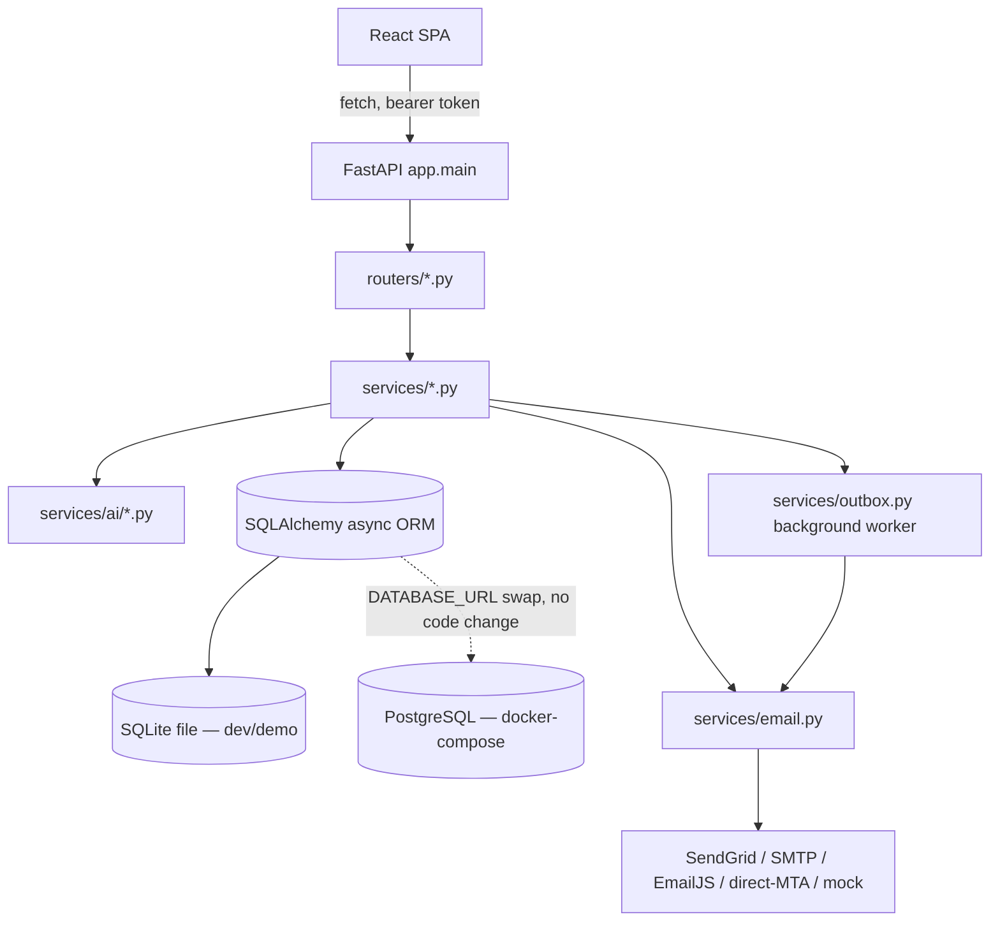
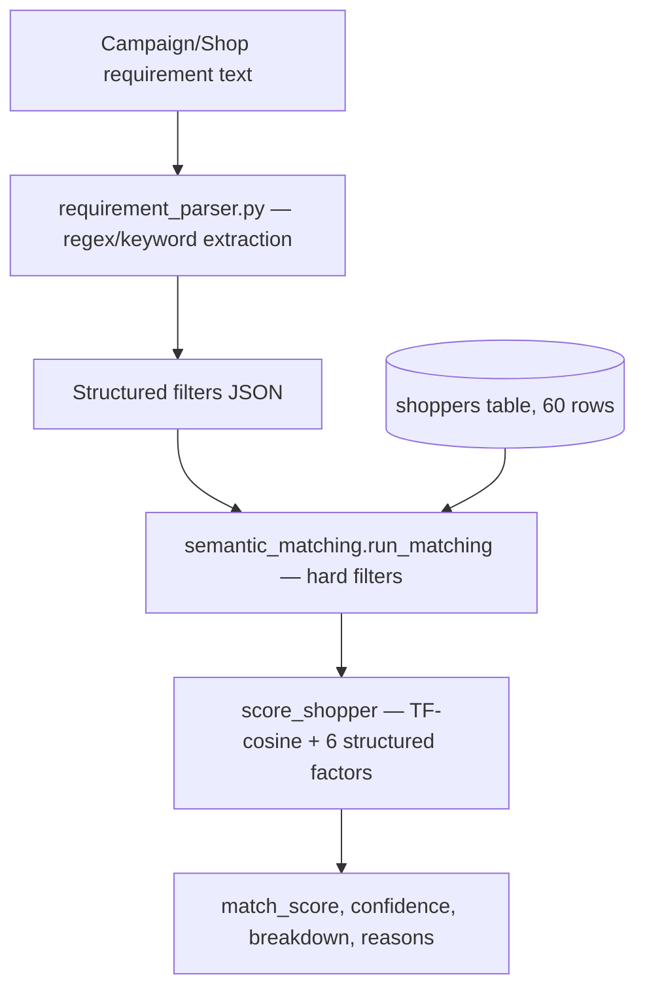
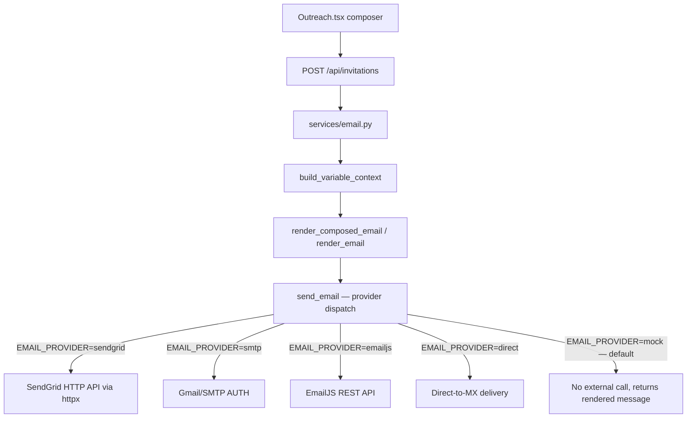
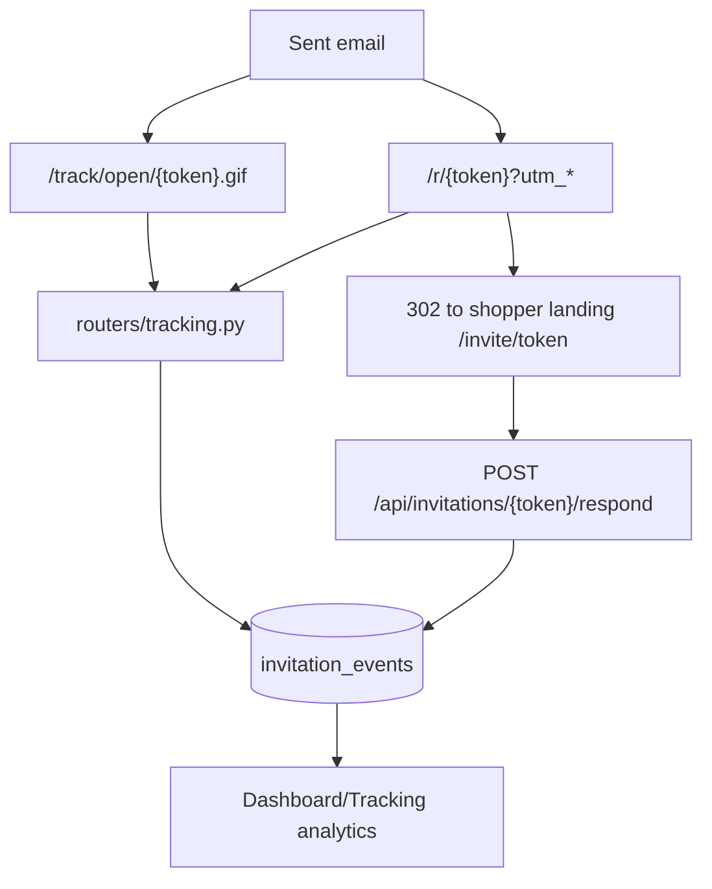
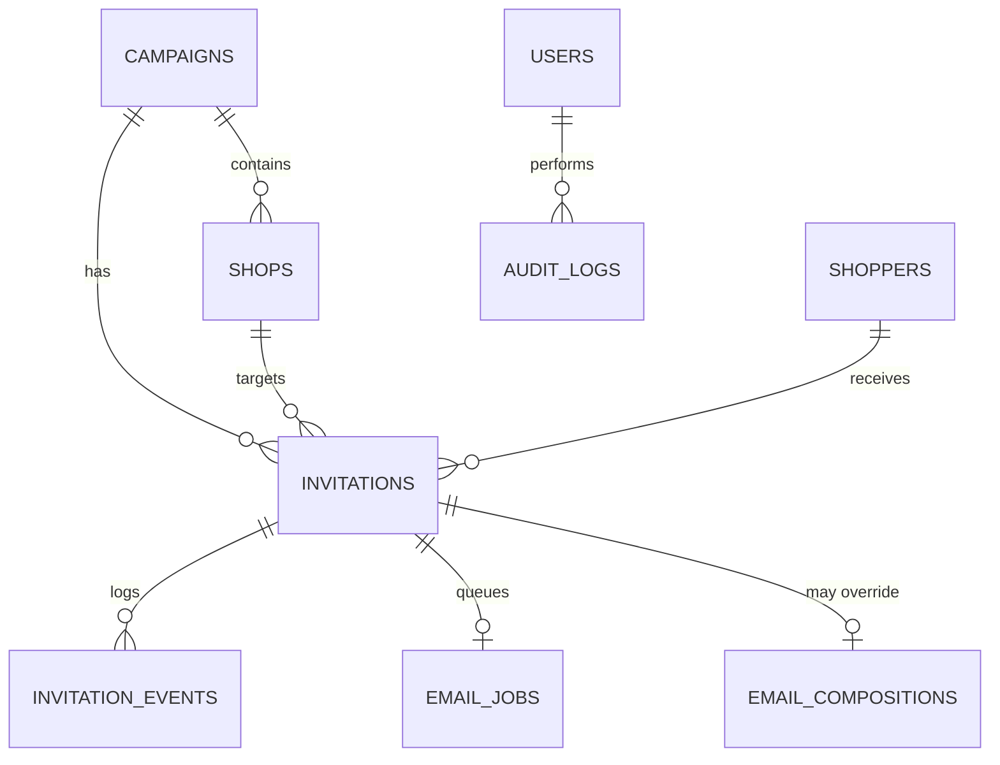
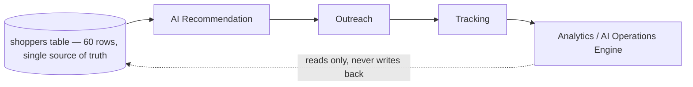

# SHOPPERMATCH.AI — Technical Architecture

Verified against the codebase on 2026-08-13. All facts (versions, files, endpoints) were read directly from source — nothing is assumed.

---

## 1. Backend Architecture

**Actual stack** (from `backend/requirements.txt`): FastAPI 0.115.6, Uvicorn 0.32.1, SQLAlchemy 2.0.36 (async), asyncpg 0.30.0, aiosqlite 0.20.0, Pydantic 2.10.4, Alembic 1.14.0, cryptography 50.0.0, httpx 0.28.1 (used for outbound HTTP to SendGrid/EmailJS/SASSIE-demo, not a Python SDK for any of them). No ORM "repository" layer exists — routers call service functions that use SQLAlchemy directly; there is no separate repository abstraction layer.

**AI services** are plain async Python functions in `backend/app/services/ai/*.py` — there is **no embedding service, no vector search service, and no external AI API call anywhere in this codebase.** `services/semantic_matching.py` implements a dependency-free term-frequency cosine-similarity function (`embed()`/`_cosine()`) as an explicitly-labeled stand-in for a real embedding model; the function boundary is deliberate so a real embedding provider could replace it later without touching any caller.

**Email architecture:**

**Tracking architecture:**

---

## 2. Frontend Architecture

Verified from `frontend/package.json`: **React 18.3.1, TypeScript 5.5.4, react-router-dom 6.26.2, Tailwind CSS 3.4.13, Recharts 2.12.7, Vite 5.4.8.** No Redux/Zustand/React Query — state is local `useState` plus one custom hook (`lib/useApi.ts`) providing `{data, loading, error, reload}`. No axios — `lib/api.ts` wraps native `fetch` with a bearer-token header and typed helper methods per endpoint.

**Pages** (`frontend/src/pages/`): `Home`, `Login`, `Dashboard`, `Campaigns`, `CampaignsPortal`, `CampaignDetail` (largest file, ~52 KB — houses Overview/Shops/Shoppers/AI Recommendations/Outreach/Tracking/Insights/Audit Logs tabs), `Shops`, `Shoppers`, `Recommendations`, `Outreach` (~39 KB), `Tracking`, `Insights`, `AuditLogs`, `Integrations`, `Settings`, `ShopperInvite` (the public unauthenticated landing page).

**Components** (`frontend/src/components/`): `Layout` (nav shell), `Icons` (inline SVG set, no icon package dependency), `ui.tsx` (Badge/Spinner/Loading/KpiCard/`useToast`), `Funnel`, `Timeline`, `Attribution`, `InvitationDrawer`, `ShopperDrawer`, `NotificationsBell`.

**Routing:** client-side via `react-router-dom`; the FastAPI backend serves the built SPA and falls back to `index.html` for any non-`/api`, non-`/r`, non-`/track` path (see `main.py::spa`), so the whole app is single-origin.

**Error handling:** every data-fetching call goes through `lib/api.ts::request()`, which throws a typed `ApiError` (status + message); pages render an `ErrorBox` component with retry. 401 responses clear the stored token automatically.

---

## 3. Database Architecture

**Engine (verified):** `sqlite+aiosqlite:///./shoppermatch.db` by default (`backend/app/config.py`). `DATABASE_URL` supports a Postgres async URL (`postgresql+asyncpg://...`) with zero code changes — the app's JSON columns use `JSON().with_variant(JSONB(), "postgresql")` and Alembic migrations use `render_as_batch` specifically so they work on both engines. **`docker-compose.yml` provisions a real Postgres 16 container** for the containerized deployment path, but the environment this was audited in runs the SQLite file directly via `uvicorn`. Both are the *same schema* — there is no separate demo-vs-production data model.

### Tables (all existing — read from `backend/app/models.py`)

| Table | Purpose | Key fields |
|---|---|---|
| `users` | Admin login | id, name, email, role, password_hash |
| `shoppers` | The 60-record demo shopper pool | see §4 |
| `campaigns` | Client campaigns | id, name, client_name, status, total/completed/remaining_shops, deadline, `requirements_text`, `parsed_requirements` (JSON), `source`, `external_id` |
| `shops` | Physical locations within a campaign | id, campaign_id, coordinates, required_shoppers, compensation, category, visit_start/end, `source`, `external_id` |
| `invitations` | One outreach message → one shopper → one shop | tracking_token (UUID), reference, status, sent/delivered/opened/clicked/responded timestamps, response, UTM fields |
| `invitation_events` | Immutable event log per invitation | event_type, event_timestamp, `metadata` (JSON, Python attr `event_metadata`) |
| `email_jobs` | Outbox queue + retry history | provider, status, attempts, last_error, next_attempt_at |
| `email_templates` | Reusable subject/body templates | name, subject, html_body, active |
| `email_compositions` | Per-invitation hand-edited subject/body override | invitation_id (unique), subject_template, html_template |
| `integration_configs` | SASSIE/Email/Maps/AI/SMS provider config + status | provider, status, `configuration` (non-secret JSON), `secret_config` (JSON, **never serialized to any API response**) |
| `sync_logs` | One row per SASSIE sync run | provider, status, campaigns/shops/shoppers fetched/created/updated, errors |
| `audit_logs` | Every logged admin/AI action | actor, action, entity_type, entity_id, summary, meta |

### ER diagram

**Labeling per the request's requirement — existing vs. proposed:**
- **Existing:** every table above.
- **Proposed / not present:** a dedicated `recommendations` table (recommendation results are computed on demand, never persisted — a deliberate choice, see §7), `ai_alerts`/`ai_action_records` tables (Operations Engine output is also computed live, not persisted — same reasoning), `assignments` as a distinct table (assignment *is* an `Invitation` row in this schema; there is no separate assignment entity).

---

## 4. The 50(+)-Member Demo Database

**Verified count:** the `shoppers` table currently holds **60 rows** — the original 50-member seed plus a 10-shopper batch added in a later session turn. This is still the single existing dataset; no second table or file was ever created to hold shopper records.

**Fields actually populated** (from `models.py` + migrations 0001–0003): `shopper_code`, `name`, `email`, `phone`, `city`, `state`, `zip_code`, `latitude`, `longitude`, `categories` (JSON list), `availability_status`, `source`, `rating`, `completion_rate`, `previous_assignments`, `active`, `gender`, `age`, `pincode`, `skills`, `experience_description`, `years_experience`, `preferred_distance_km`, `preferred_locations`, `preferred_categories`, `languages`, `certifications`, `previous_clients`, `updated_at`, `external_id`.

**Every AI feature reads from this one table** — requirement parsing produces filters that are applied to it, matching scores it, the acceptance predictor reads `invitations` joined back to it, data quality/anomaly detection scan it directly, and the Operations Engine's shopper-gap agent counts against it. No AI feature has ever written to a second dataset, mock array, or JSON fixture.

---

## 5. API Architecture

Every route below was found in the router source (see grep audit in the MVP Scope doc). Full method/path/auth table:

| Router (prefix) | Method | Path | Auth | Purpose |
|---|---|---|---|---|
| auth (`/api/auth`) | POST | `/login` | none | Issue bearer token |
| | GET | `/me` | bearer | Current user |
| campaigns (`/api/campaigns`) | GET | `` | bearer | List (bucket filter) |
| | GET | `/{id}` | bearer | Detail |
| | GET | `/{id}/shops` \| `/shoppers` \| `/outreach` \| `/tracking` \| `/insights` | bearer | Sub-resources |
| | GET | `/{id}/shops/{id}/recommendations` | bearer | AI matching |
| | POST | `/{id}/shops/{id}/recommendations/approve` | bearer | Create invitations |
| shops (`/api/shops`) | GET | `` \| `/{id}` \| `/{id}/recommendations` | bearer | Shop data + shop-scoped matching |
| shoppers (`/api/shoppers`) | GET | `` \| `/{id}` \| `/{id}/campaign-history` | bearer | Shopper directory |
| recommendations (`/api/recommendations`) | GET | `` | bearer | Cross-campaign recommendation feed |
| invitations (`/api/invitations`) | POST | `` | bearer | Create invitation |
| | GET | `` \| `/{id}` \| `/{id}/email` | bearer | List/detail/preview |
| | POST | `/{id}/simulate` \| `/send` \| `/send-test` \| `/follow-up` | bearer | Lifecycle actions |
| email-templates (`/api/email-templates`) | GET/POST/PUT/DELETE, `/{id}/duplicate` | bearer | CRUD |
| tracking | GET | `/r/{token}` | none (public, token-gated) | Click redirect |
| | GET | `/track/open/{token}.gif` | none | Open pixel |
| | GET | `/api/public/sample-invitation` \| `/api/public/invitations/{token}` | none | Shopper landing data |
| | POST | `/api/invitations/{token}/respond` | none (token-gated) | Accept/decline |
| | GET | `/api/tracking/summary` \| `/api/tracking/events` | bearer | Analytics |
| notifications (`/api/notifications`) | GET | `` | bearer | Recent event feed |
| integrations (`/api/integrations`) | GET | `` \| `/sync-logs` \| `/{provider}` | bearer | Status |
| | PUT | `/{provider}/config` | bearer | Update config/secrets |
| | POST | `/{provider}/test` \| `/email/test-send` \| `/sassie/sync` | bearer | Test/sync |
| webhooks (`/api/webhooks`) | POST | `/sendgrid` | signature-verified (optional key) | Delivery/open/click/bounce events |
| ai (`/api/ai`) | POST | `/parse-requirements` | bearer | Requirement parser |
| | GET | `/acceptance-probability` | bearer | Acceptance predictor |
| | GET | `/campaigns/{id}/shops/{id}/outreach-priority` | bearer | Outreach prioritization |
| | GET | `/campaigns/{id}/health` \| `/performance` | bearer | Campaign predictor |
| | POST | `/campaigns/{id}/optimize-assignments` | bearer | Assignment optimizer |
| | GET | `/anomalies` \| `/data-quality` | bearer | Risk/quality agents |
| | GET | `/campaigns/{id}/feedback-analysis` | bearer | Report/sentiment/QA |
| | POST | `/ask` | bearer | NL insights / Operations Assistant |
| | GET | `/next-best-actions` \| `/action-center` | bearer | Operations Engine |
| | POST | `/personalize-email` | bearer | Email personalization |
| dashboard (`/api/dashboard`) | GET | `/metrics` | bearer | Dashboard KPIs |
| misc (`/api`) | GET | `/audit-logs` \| `/insights` \| `/settings` | bearer | Admin utilities |

No endpoint in the above list is `PROPOSED` — every one is live in the current router files. There is no rate-limited/paginated cursor API (list endpoints return full arrays), and there is no GraphQL layer.

---

## 6. Integration Architecture

| Integration | Purpose | Direction | Auth | Status (verified) | Failure handling |
|---|---|---|---|---|---|
| **SASSIE** | Shopper/campaign data sync | Inbound (pull) | API key/client ID (optional) | 🟡 Demo adapter (`services/integrations/sassie.py`) always usable; real API path exists in code but no real credentials configured — status reported as `DEMO`, never fake `CONNECTED` | `sync_logs` records failed/partial runs; Operations Engine surfaces staleness via `integration_awareness.py` |
| **SendGrid** | Outbound email delivery | Outbound | API key | 🟡 Code path fully implemented (`_send_via_sendgrid`); `EMAIL_PROVIDER` defaults to `mock` (no external call) unless a real key is set | Outbox worker retries up to `EMAIL_MAX_ATTEMPTS` (3); webhook records bounces/failures |
| **SendGrid Event Webhook** | Delivery/open/click/bounce events | Inbound | Optional ECDSA signature verification key | 🟢 Implemented (`routers/webhooks.py`) | Unverified requests accepted if no key configured (documented as demo-only) |
| **Google Maps** | Geocoding/distance | Outbound | API key | 🔴 Config/test UI exists; **no live geocoding call is used by matching** — `haversine_km` (pure coordinate math) is what recommendations actually use | N/A — falls back to coordinate math automatically |
| **SMS provider** | Outreach via SMS | Outbound | API key | 🔴 Config UI only, no send code path | N/A |
| **AI provider (OpenAI/Gemini/etc.)** | External AI model | Outbound | API key | 🔴 Not used anywhere — `services/semantic_matching.py` explicitly does not call any external AI API; `AI_PROVIDER`/`AI_API_KEY` env vars exist only so a future swap is a config change | N/A |
| **PostgreSQL** | Primary datastore (production path) | — | connection string | 🟢 Supported (docker-compose provisions it); SQLite used in this dev environment | Alembic migrations target both |
| **Vector database** | Embedding storage/search | — | — | 🔵 Not present — TF-cosine is computed in-process, no vector index needed at 60-row scale | N/A |
| **Redis / Celery** | Background job queue | — | — | 🔵 Not present — `services/outbox.py` implements an in-process asyncio background task instead | N/A |

---

## 7. Deliberate Non-Implementations (and why)

These were requested in various rounds of scope but intentionally not built, to avoid unused infrastructure in a 60-record demo:

| Item | Reason not built |
|---|---|
| Real sentence-embedding model / vector DB | TF-cosine similarity over 60 shopper profiles is sub-millisecond; a vector index would add infra with no measurable benefit at this scale. The `embed()` function boundary is intentionally isolated so this can change later without touching any caller. |
| Embedding/recommendation caching | Same reasoning — recomputing 60 scores per request is already cheap; a cache would add invalidation complexity for no latency win. |
| Neo4j graph layer | No regional-density/relationship query has been requested that a SQL query can't already answer at this data volume. |
| Kafka / event bus | No consumer currently needs to react to `SHOPPER_UPDATED`-style events asynchronously; the existing outbox worker + on-demand computation cover every current use case. |
| LangGraph / CrewAI multi-agent framework | The Operations Engine already separates responsibilities into 5 distinct agent functions with a clear detect→analyze→recommend→approve flow. Adding an orchestration framework wouldn't change behavior — the explicit instruction was not to add one "merely for branding." |
| Multi-role RBAC enforcement | `users.role` column exists but no route branches on it; only one admin account is used throughout the demo. Real RBAC is a proposed Phase 4 item. |
