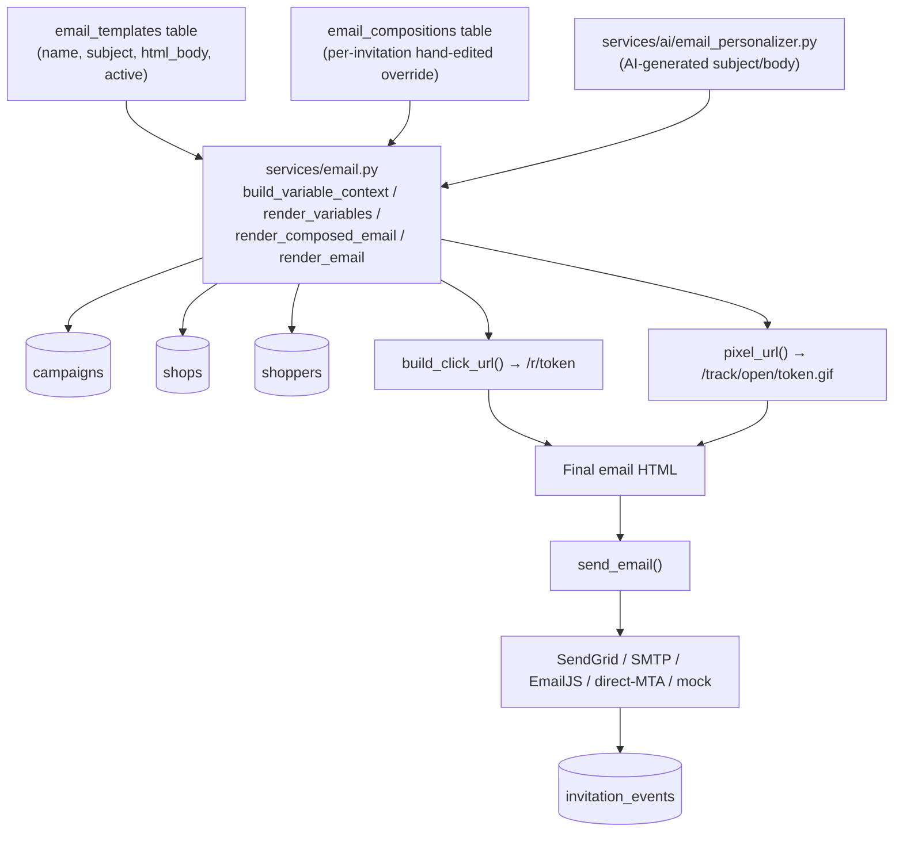
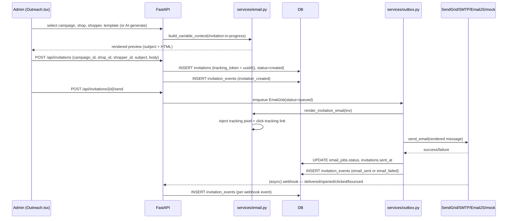

# SHOPPERMATCH.AI — Email Templates & Outreach Architecture

This document answers the explicit brief: Email Templates must not be an isolated UI feature — it must be interconnected with Outreach through one reusable backend rendering service. **Verified finding: this is already true in the current codebase.** `services/email.py` is that one shared service; both the Email Templates CRUD and the Outreach composer's AI-generation path render through it. Nothing here needed to be built to satisfy the "no duplicated logic" requirement — this document describes what exists and calls out the gaps precisely.

---

## 1. Architecture (as implemented)



**One rendering service, two callers, zero duplicated logic** — confirmed by reading `services/email.py`: `build_variable_context()` and `render_variables()` are called identically whether the subject/body came from a saved `EmailTemplate`, a hand-edited `EmailComposition`, or an AI-generated draft from `email_personalizer.py`. The AI generation endpoint (`POST /api/ai/personalize-email`) returns `{subject, body}` text which the Outreach composer loads into the *same* editable state (`setSubject`/`setBody`) used for template-based drafts — it does not bypass the renderer or the review step.

---

## 2. Email Template Module — current state vs. requested fields

| Requested field | In `EmailTemplate` model today? | Status |
|---|---|---|
| `name` | ✅ | 🟢 Implemented |
| `subject` | ✅ | 🟢 Implemented |
| `html_body` | ✅ | 🟢 Implemented |
| `active` | ✅ (boolean) | 🟢 Implemented |
| `created_at` / `updated_at` | ✅ | 🟢 Implemented |
| `text_body` (plain-text alternative) | ❌ | 🔴 Pending |
| `category` | ❌ | 🔴 Pending |
| `description` | ❌ | 🔴 Pending |
| `created_by` | ❌ (no user attribution on templates) | 🔴 Pending |
| `is_default` | ❌ (no "set as default template" concept) | 🔴 Pending |

**Requested actions vs. implemented endpoints:**

| Action | Endpoint | Status |
|---|---|---|
| Create | `POST /api/email-templates` | 🟢 |
| Edit | `PUT /api/email-templates/{id}` | 🟢 |
| Delete | `DELETE /api/email-templates/{id}` | 🟢 |
| Duplicate | `POST /api/email-templates/{id}/duplicate` | 🟢 |
| List | `GET /api/email-templates` | 🟢 |
| Save (from Outreach composer, "Save as Template") | Uses the same `POST /api/email-templates` | 🟢 |
| Preview | No dedicated template-preview endpoint; preview happens client-side after variable substitution in the Outreach composer, and server-side via `GET /api/invitations/{id}/email?preview=true` once an invitation exists | 🟡 Partial — works at the invitation level, not as a standalone "preview this template" action |
| Test Email | `POST /api/invitations/{id}/send-test` (invitation-scoped) and `POST /api/integrations/email/test-send` (generic connectivity test) — no *template-scoped* test-send | 🟡 Partial |
| Use Template | Selecting it in the Outreach composer's Template dropdown | 🟢 |
| Set Default Template | No such concept exists | 🔴 Pending |

### Variable tokens

**Requested vs. actually supported** (from `services/email.py::VARIABLE_TOKENS` and `build_variable_context()`):

| Requested token | Actual implementation |
|---|---|
| `{{shopper_name}}` | ✅ exact match (first name only) |
| `{{shop_name}}` | ✅ exact match |
| `{{campaign_name}}` | ✅ exact match |
| `{{location}}` | ✅ exact match (city, state) |
| `{{compensation}}` | ✅ exact match (formatted with currency symbol) |
| `{{deadline}}` | ✅ present, but **actually renders the shop's visit window** (`_fmt_window(visit_start, visit_end)`), not the campaign deadline field |
| `{{visit_window}}` | ❌ not a separate token — folded into `{{deadline}}` above |
| `{{assignment_link}}` | ✅ exact match (click-tracking URL with UTM params) |
| `{{client_name}}` | ✅ exact match |
| `{{invitation_id}}` | ✅ present but not in the original request list — maps to the human-readable reference (e.g. `INV-0007`) |

Unknown `{{token}}` patterns are deliberately left as literal text in the output (not silently dropped) so a typo is visible in preview rather than producing blank text — verified in `render_variables()`.

---

## 3. Email Send Workflow (as implemented)



Every step above is a real code path (`routers/invitations.py`, `services/email.py`, `services/outbox.py`, `routers/webhooks.py`) — none is proposed.

---

## 4. Email Tracking Architecture (Section 14)

| Concept | Implementation | Table/field |
|---|---|---|
| Tracking Token | `uuid4()` generated per invitation, never a raw DB id | `invitations.tracking_token` |
| Tracking URL | `/r/{token}?utm_source=...` | Built by `build_click_url()` |
| Tracking Pixel | `/track/open/{token}.gif` — 1×1 transparent gif, no JS required | Built by `pixel_url()`, served by `routers/tracking.py` |
| Invitation | One row per (campaign, shop, shopper) outreach attempt | `invitations` |
| Invitation Event | Immutable append-only log | `invitation_events` |

**Events actually recorded** (from `models.py::EventType`): `invitation_created`, `email_queued`, `email_sent`, `email_delivered`, `email_opened`, `link_clicked`, `assignment_accepted`, `assignment_declined`, `email_bounced`, `email_failed`, `email_deferred`. This is a superset of the requested sent/delivered/opened/clicked/accepted/declined list — bounce/failure/deferral are also tracked.

**Rates calculated (Dashboard + Tracking pages, `routers/dashboard.py`):**

```
open_rate       = opened / delivered
click_rate      = clicked / opened
acceptance_rate = accepted / clicked
response_rate   = (accepted + declined) / sent
```

All computed live from `invitation_events`/`invitations` rows at request time — never fabricated, never cached as a stale stored percentage.

**Privacy/security:** the click and pixel endpoints only ever look up the exact token in the URL (no enumeration or listing), tokens are UUIDv4 (not sequential/guessable), and no personal data beyond what the invitation already needed is embedded in the URL.

---

## 5. Outreach Architecture Summary

```
Campaign → Shop → Shopper → Template (or AI) → Invitation → Tracking Token → Email → SendGrid → Events → Response
```

| Capability | Status |
|---|---|
| Email generation (template) | 🟢 |
| Email generation (AI-personalized) | 🟢 |
| Email preview | 🟢 (composer-level); 🟡 (no template-only preview endpoint) |
| Template selection | 🟢 |
| Personalization (variable substitution) | 🟢 |
| Tracking (pixel + click) | 🟢 |
| Sending (multi-provider) | 🟢 |
| Retry on failure | 🟢 (`services/outbox.py`, up to 3 attempts) |
| Failure surfacing | 🟢 (`email_jobs.last_error`, `invitation_events`) |
| Audit logging | 🟢 (`record_audit()` on AI-generated actions; invitation lifecycle also logged via `invitation_events`) |
| Send test email | 🟢 (invitation-scoped and generic connectivity test) |
| Follow-up generation | 🟢 (`POST /{id}/follow-up`, and AI Action Center's "Generate Follow-up" for opened-not-accepted campaigns) |

---

## 6. What Is Genuinely Proposed (not implemented)

- `EmailTemplate.text_body`, `.category`, `.description`, `.created_by`, `.is_default` columns — would need a new Alembic migration (`ALTER TABLE email_templates ADD COLUMN ...`), following the existing safe pattern (backup DB file → migrate → verify row counts).
- A template-scoped preview/test-send endpoint (currently only invitation-scoped).
- Per-client default template selection.

None of these gaps block the current end-to-end outreach flow — they are refinements, not missing critical paths.
