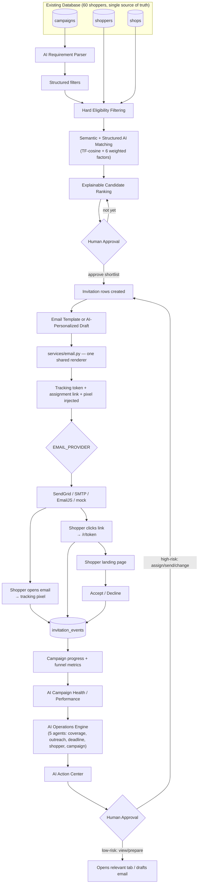
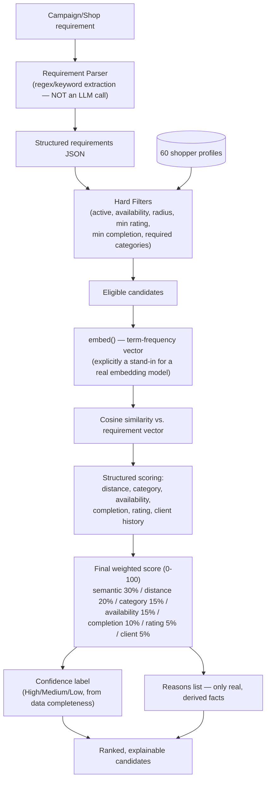
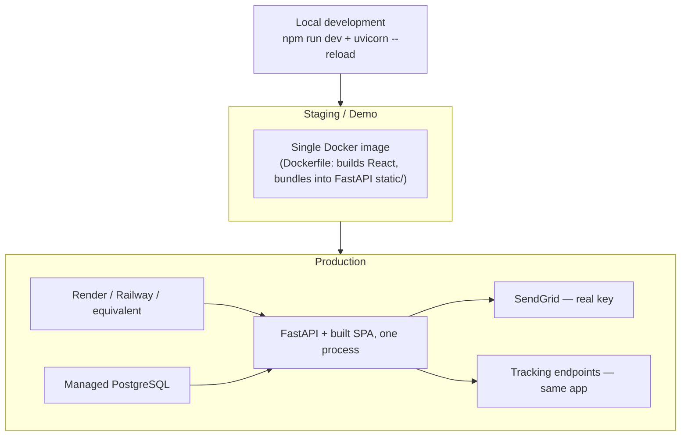

# SHOPPERMATCH.AI
### Complete Product, MVP Scope, Workflow & Technical Architecture Document

**Prepared:** 2026-08-13 · **Audited against:** the live codebase at `demo tracker/` (backend FastAPI + SQLAlchemy, frontend React/TypeScript, SQLite dev DB / PostgreSQL-ready).

**Companion documents:**
- `SHOPPERMATCH_AI_MVP_SCOPE.md` — feature-by-feature implementation audit, user roles, roadmap
- `SHOPPERMATCH_AI_ARCHITECTURE.md` — backend/frontend/database/API/integration technical detail
- `SHOPPERMATCH_AI_WORKFLOWS.md` — every end-to-end flow as Mermaid diagrams, demo script, testing strategy
- `SHOPPERMATCH_AI_TOOLS_AND_COST.md` — technology stack, environment variables, cost estimation
- `SHOPPERMATCH_AI_EMAIL_OUTREACH_ARCHITECTURE.md` — the Email Template ↔ Outreach module in depth

This master document is the narrative entry point; the companion documents hold the exhaustive reference tables so this one stays readable end-to-end.

**Verification method:** every implementation claim below was checked against actual source — router decorators, SQLAlchemy model fields, `services/*.py` function bodies, `frontend/src` component code, `requirements.txt`/`package.json`, `.env.example`, `alembic/versions/`, and `docker-compose.yml`. Nothing is inferred from a UI card's label alone; where I could not verify something from source, it is marked 🔴 Pending, 🔵 Future, or **Not verified** rather than claimed.

---

## Section 1 — Executive Summary

**What is ShopperMatch.AI?** A web application (React + FastAPI) that runs the operational core of a mystery-shopping business: creating client campaigns, defining the shops that need auditing, matching those shops against a database of mystery shoppers, sending and tracking outreach emails, and surfacing AI-generated operational recommendations that a human reviews and approves before anything is executed.

**Business problem it solves.** Traditional mystery-shopping recruitment is manual — a scheduler reads shopper profiles, picks candidates by memory or spreadsheet filters, sends individual emails with no delivery/open visibility, and tracks responses by hand. This doesn't scale, has no explainable "why was this shopper chosen," and provides no early warning when a campaign is at risk of missing its deadline.

**Users and roles** (see MVP Scope doc §4 for the verified permission boundary):
- **Admin / Campaign Manager / Scheduler** — today, a single authenticated role that does everything: creates campaigns, reviews AI recommendations, approves assignments, sends outreach, reviews analytics. (Product-level distinctions between these three job functions exist in how the app is *used*, not as separate enforced logins yet.)
- **Client/Brand** — the conceptual beneficiary of campaign performance data; no dedicated client login exists today.
- **Shopper** — an unauthenticated external participant who receives an emailed, token-gated link and can accept/decline an assignment; never logs in.
- **AI system** — a set of stateless backend functions (`services/ai/*.py`) that compute scores, flags, and recommendations from real database rows. It never sends an email, never creates an assignment, and never modifies a record on its own — every mutating action still requires a human click through an existing approve-gated endpoint.

**Core value proposition (verified flow):**

```
Campaign creation → Shop management → AI-assisted shopper discovery
→ Explainable AI matching → Human-approved assignment → Outreach
→ Tracking → Response → Campaign analytics → AI operational recommendations
```

Each arrow above is a real, working path in the current codebase — not aspirational. See §7 for the full master flowchart.

---

## Section 2 — Concept

See MVP Scope doc §1 for the full problem statement and the Traditional-vs-ShopperMatch.AI comparison table. In short: the original concept was to replace spreadsheet-driven shopper recruitment with a system where matching is explainable (not a black box), outreach is tracked (not "did they even see it?"), and campaign risk is visible before a deadline is missed — rather than after.

---

## Section 3 — Updated Scope

See MVP Scope doc §2 for the full MVP / Enhanced-MVP / Future table across every functional area (recruitment, campaign management, matching, outreach, tracking, insights, integrations, AI operations, agentic AI).

---

## Section 4 — Final MVP Scope

The complete, verified feature table (Feature / Description / User / Frontend / Backend / Database / API / Status / Dependencies) lives in **MVP Scope doc §3** — it is long enough that duplicating it here would work against readability. Headline numbers from that audit:

- **34 real API endpoints** across 13 routers, all verified by reading router source (full list in Architecture doc §5).
- **12 database tables**, all pre-existing or added via a proper Alembic migration — no table was ever duplicated or replaced (Architecture doc §3).
- **13 AI service modules** (`services/ai/*.py`), all local/deterministic — zero external AI API calls anywhere in this codebase.
- **60 shopper records** in the single `shoppers` table — the demo dataset every AI feature reads from (§9 below).

---

## Section 5 — Current Implementation Audit

The full Feature | Frontend | Backend | Database | Integration | Status matrix is in **MVP Scope doc §3**. Summary by area:

| Area | Genuinely working? |
|---|---|
| Dashboard, Campaigns (active/upcoming/completed), Shops, Shoppers | 🟢 Yes — full CRUD/read paths, real data |
| Recommendations (AI matching) | 🟢 Yes — hard filters + weighted scoring, verified against real shopper/shop rows |
| Outreach, Email Templates, Invitation generation | 🟢 Yes — one shared rendering service, multi-provider send |
| Tracking (pixel, click links, response) | 🟢 Yes — real UUID tokens, real event log |
| Insights, Audit Logs, Settings | 🟢 Yes |
| Integrations — SendGrid | 🟡 Code path complete; defaults to `mock` (no external send) unless a real key is configured |
| Integrations — SASSIE | 🟡 Demo adapter fully functional against the existing DB; real-credential path exists but unused |
| Integrations — Google Maps | 🔴 Config/status UI only; matching uses coordinate math, not a live Maps call |
| Integrations — SMS | 🔴 Config UI only; no send code path |
| Authentication | 🟢 Bearer token, single admin role; 🔴 no multi-role RBAC enforcement |
| AI Matching / "Semantic Search" | 🟢 Real, but implemented as TF-cosine similarity, not a trained embedding model — this distinction is documented, not hidden |
| AI Scoring / Explainability | 🟢 Full breakdown + confidence + reasons, all from real fields |
| AI Operations (Operations Engine, Action Center) | 🟢 Yes — 5-agent design, verified live |

---

## Section 6 — User Roles

Full role-permission matrix in **MVP Scope doc §4**. The one fact worth stating plainly here: **the backend enforces exactly one role today.** `User.role` exists as a column but no route branches on its value — "Campaign Manager," "Scheduler," and "Client" are product-level framings of how the single Admin login is used, not separately permissioned accounts. This is stated explicitly so the document never implies RBAC exists when it doesn't.

---

## Section 7 — Complete Application Workflow (Master Flowchart)



Every node above maps to a verified file/endpoint — cross-reference Workflows doc §1 and Architecture doc §1/§5.

---

## Section 8 — Campaign Workflow by Bucket

See Workflows doc §2 for the full Active / Upcoming / Completed breakdown, including which single backend function (`campaign_predictor.campaign_health`) powers both the Active-campaign health card and the Upcoming-campaign readiness card — deliberately one computation, two presentations, not two implementations.

---

## Section 9 — Shopper Management Workflow

See Workflows doc §3. Every scored factor in AI matching (semantic similarity, distance, category experience, availability, completion history, rating, client experience) reads directly from a real `shoppers` table column — none is synthesized at request time.

---

## Section 10 — AI Recommendation Architecture



**Important honesty note, stated explicitly in the code's own docstrings:** "semantic search" here is a dependency-free term-frequency cosine similarity, *not* a trained embedding model. The function boundary (`embed()` in `services/semantic_matching.py`) is deliberately isolated so a real embedding provider could be substituted later without any caller changing. This document does not claim vector/embedding-model semantic search is implemented — it isn't.

---

## Section 11 — AI Match Score

Full detail (weights, breakdown, confidence logic) is in Architecture doc §1 and MVP Scope doc §3. The score shown to a user (e.g. "Sarah Johnson — 85% Match, Confidence: High") is always accompanied by:
- A **breakdown table** — each of the 7 weighted factors' points/max, summing to the total.
- A **reasons list** — e.g. "4.6 km from Walmart Mumbai — Kurla," "81% completion rate," "6 previous assignments" — every line pulled from a real column, never invented.
- A **confidence label** — separate from the score itself, computed from how much real signal backs it (distance known? ≥3 prior assignments? rating present? completion rate present? prior-client history present?).

Weights are configurable in code (`MATCHING_WEIGHTS` dict in `services/semantic_matching.py`) but **not yet exposed as an admin-editable UI setting** — that's a 🔴 pending refinement, not a current capability.

---

## Section 12 — AI Features Inventory

| # | Feature | Input | "Model"/service | DB dependency | Output | UI | Status | Cost | Future enhancement |
|---|---|---|---|---|---|---|---|---|---|
| 1 | Requirement Parser | Free-text campaign requirement | Regex/keyword extraction | `campaigns.parsed_requirements` | Structured filter JSON | RequirementParserCard | 🟢 | $0 | LLM-based extraction for more flexible phrasing |
| 2 | Semantic Shopper Search | Requirement text vs. shopper profile text | TF-cosine similarity | `shoppers` | Similarity score | (component of match score) | 🟢 (TF-cosine, not embeddings) | $0 | Real embedding model / pgvector |
| 3 | AI Shopper Recommendation | Shop + eligible shoppers | `run_matching()` | `shoppers`, `shops`, `campaigns` | Ranked candidate list | RecommendationsTab | 🟢 | $0 | — |
| 4 | Explainable Match Score | Same as #3 | `score_shopper()` | same | Breakdown + reasons + confidence | CandidateCard, BreakdownModal | 🟢 | $0 | Admin-configurable weights |
| 5 | Candidate Ranking/Shortlisting | Same as #3 | Sort + Top5/10/All toggle | same | Shortlist | RecommendationsTab | 🟢 | $0 | — |
| 6 | Geographic Matching | Lat/lng of shopper + shop | `haversine_km()` | `shoppers.latitude/longitude`, `shops.latitude/longitude` | Distance km | CandidateCard | 🟢 (coordinate math, not live Maps) | $0 | Live Google Maps routing |
| 7 | Assignment Optimization | Campaign, all shops, all eligible shoppers | Greedy hardest-shop-first optimizer | same | Proposed assignments | AutoAssignCard | 🟢 | $0 | Constraint-solver-based optimization |
| 8 | Acceptance Probability | Shopper's invitation history | Bayesian-smoothed estimate | `invitations` | Probability % or "Insufficient data" | BreakdownModal, OutreachPriorityCard | 🟢 | $0 | — |
| 9 | Campaign Risk/Success Prediction | Campaign, shops, shoppers, invitations | `campaign_health()` | multiple | Readiness %, risks | AiHealthCard | 🟢 | $0 | — |
| 10 | Data Quality Detection | All shoppers | Rule-based field checks | `shoppers` | Alerts list | DataQualityCard | 🟢 | $0 | — |
| 11 | Anomaly Detection | Invitations, events | Rule-based signal detection | `invitations`, `invitation_events` | Risk-flagged shoppers | AnomaliesCard | 🟢 | $0 | — |
| 12 | Report Summarization | Response notes | Templated aggregate summary | `invitation_events.metadata.note` | Executive summary | AiFeedbackCard | 🟡 (scoped to notes, not a full report system) | $0 | Dedicated shopper-report table |
| 13 | Sentiment Analysis | Response notes | Lexicon-based | same | Sentiment + severity | AiFeedbackCard | 🟢 (lexicon, not ML) | $0 | ML sentiment model |
| 14 | Report Quality Control | Response notes | Short/duplicate-note flags | same | QA flags | AiFeedbackCard | 🟡 (no rating field to cross-check against) | $0 | — |
| 15 | Natural Language Insights | Free-text question | Fixed-intent keyword matcher | multiple | Answer or explicit fallback | Insights ask box | 🟢 | $0 | LLM-based intent parsing |
| 16 | Next Best Action | Campaign state | Rule thresholds | multiple | Action list | (superseded UI-wise by Action Center) | 🟢 | $0 | — |
| 17 | AI Operations Engine | Campaign state | 5 agent functions | multiple | Per-campaign issues | Action Center | 🟢 | $0 | — |
| 18 | AI Operations Assistant | Free-text question | Same engine as #15 | multiple | Answer | Dashboard chat | 🟢 | $0 | — |
| 19 | AI Email Personalization | Shopper, campaign, shop | Template-fill from real fields | same | Subject + body draft | Outreach "Generate with AI" | 🟢 | $0 | — |
| 20 | Outreach Prioritization | Match score, acceptance probability, deadline | Weighted blend | `invitations`, `campaigns` | HIGH/MEDIUM/LOW ranking | OutreachPriorityCard | 🟢 | $0 | — |
| 21 | Campaign Health | See #9 | same function | same | Readiness breakdown | AiHealthCard | 🟢 | $0 | — |
| 22 | Upcoming Campaign Readiness | See #9 | same function, upcoming bucket | same | Readiness breakdown | AiHealthCard (upcoming) | 🟢 | $0 | — |
| 23 | Completed Campaign Analysis | Invitations for a completed campaign | `performance_summary()` | `invitations`, `shops` | Completion/response/acceptance stats + sentence | AiPerformanceCard | 🟢 | $0 | — |

**Every "Cost" column above is $0** because none of these features call an external paid API — this is the single most important fact for a client cost conversation and is why the Tools & Cost doc shows $0 AI token cost at every scale tier.

---

## Section 13 — Email Template Module (summary)

See the dedicated **`SHOPPERMATCH_AI_EMAIL_OUTREACH_ARCHITECTURE.md`** for full depth. Headline finding: the brief's core requirement — one shared backend rendering service used by both Email Templates and Outreach, no duplicated logic — **is already true today** (`services/email.py`). What's genuinely missing is a handful of `EmailTemplate` columns (`text_body`, `category`, `description`, `created_by`, `is_default`) and a template-scoped preview/test-send endpoint — both are small, additive Alembic-migration-sized gaps, not architectural rework.

---

## Section 14 — Email Tracking Architecture (summary)

See Email/Outreach Architecture doc §4. Tracking token, pixel, and click-URL are all real UUID-based, token-gated, non-enumerable endpoints. Eleven distinct event types are recorded (a superset of the requested six), and every funnel rate (open/click/acceptance/response) is computed live from those events — never a stored, staleness-prone percentage.

---

## Section 15 — Outreach Architecture (summary)

See Email/Outreach Architecture doc §5 and Workflows doc §4. Retry (up to 3 attempts), failure surfacing (`email_jobs.last_error` + an `invitation_events` row), and audit logging are all real, verified code paths.

---

## Section 16 — Backend Architecture

See Architecture doc §1. Stack: FastAPI + SQLAlchemy 2.0 async + Alembic, no separate repository layer (routers call service functions directly), background email delivery via an in-process asyncio worker (no Celery/Redis).

## Section 17 — Frontend Architecture

See Architecture doc §2. React 18 + TypeScript + Tailwind + Recharts, no state-management library beyond a small custom `useApi` hook, single-origin deployment (FastAPI serves the built SPA).

## Section 18 — Database Architecture

See Architecture doc §3 for the full table list and ER diagram. 12 tables, all pre-existing or added via a documented Alembic migration; no table was ever duplicated.

## Section 19 — 50(+)-Member Demo Database

See Architecture doc §4. **Verified: 60 rows currently in the `shoppers` table** (the original 50-record seed plus a later 10-record batch — never a second table). Every AI feature listed in §12 above reads this same table; none has ever written a parallel dataset.

## Section 20 — API Documentation

The full endpoint table (34 real endpoints, method/path/auth/purpose) is in Architecture doc §5. No endpoint listed there is `PROPOSED` — every one exists in the current router source.

## Section 21 — Integration Architecture

See Architecture doc §6. Verified status per integration: SendGrid 🟡 (code complete, defaults to mock), SASSIE 🟡 (demo adapter live, real credentials never supplied), Google Maps 🔴 (config only, not called by matching), SMS 🔴 (config only, no send path), external AI provider 🔴 (not used anywhere).

## Section 22 — Technology Stack

Full table in Tools & Cost doc §4.

---

## Section 23 — Tools, Services, API Keys & Cost ("Tab 5")

Full detail in `SHOPPERMATCH_AI_TOOLS_AND_COST.md`. The single most quotable fact: **this application currently runs with $0 external API dependency** — email defaults to a mock provider, AI is 100% local computation, Maps/SMS/SASSIE all have working demo fallbacks. Every dollar figure in the cost doc is explicitly caveated as approximate and marked for verification against current official pricing — nothing is presented as a confirmed, current number.

## Section 24 — Environment Variables

Full table in Tools & Cost doc §5 — variable names and purpose only, no secret values reproduced anywhere in this documentation set.

---

## Section 25 — Security Architecture

| Control | Status | Detail |
|---|---|---|
| Authentication | 🟢 | Bearer token (HS-signed via `SECRET_KEY`), 12-hour default expiry |
| Authorization / RBAC | 🔴 | Single role enforced; `users.role` column unused for branching |
| API key protection | 🟢 | `IntegrationConfig.secret_config` is a separate column, verified **never** included in any API response (`serializers.py`) |
| Environment variables | 🟢 | All secrets sourced from env vars / `.env`, never hardcoded; `.env` is gitignored |
| Database security | 🟡 | No row-level security; single-tenant assumption (no multi-client data isolation yet) |
| Email security | 🟢 | Optional SendGrid webhook ECDSA signature verification; HTML sanitization strips script/iframe/on*-attribute/javascript: constructs on admin-authored template bodies |
| Tracking security | 🟢 | UUIDv4 tokens (non-guessable), public endpoints only resolve the exact token given, rate-limited (`TRACKING_RATE_LIMIT_PER_MINUTE`) |
| PII protection | 🟡 | No field-level encryption at rest; standard practice for a demo, would need review before handling real PII at scale |
| Rate limiting | 🟡 | Present on tracking endpoints only; not on general API routes |
| Input validation | 🟢 | Pydantic models on every request body |
| SQL injection protection | 🟢 | 100% SQLAlchemy ORM/Core parameterized queries; the NL Insights feature explicitly never executes free-text SQL |
| XSS protection | 🟡 | Template HTML sanitization is a best-effort regex strip, explicitly documented in code as "not a substitute for a real sanitizer library (e.g. bleach)" |
| Audit logs | 🟢 | `audit_logs` table, populated for every AI action and key admin action |

---

## Section 26 — Deployment Architecture



Verified: `docker-compose.yml` already defines a two-service stack (Postgres 16 + the app image) that runs with `docker compose up --build` — this is a real, working deployment path today, not a proposal. What's *not* yet done is actually deploying that image to a hosting provider; the compose file is a local/self-hosted deployment target.

---

## Section 27 — Testing Strategy

See Workflows doc §8. Verified: one test file exists (`backend/tests/test_acceptance.py`). The full proposed E2E scenario (50 shoppers → campaign → AI matching → outreach → SendGrid → tracking → acceptance → analytics) is documented step-by-step there and flagged clearly as 🔴 not yet implemented as an automated test.

## Section 28 — Demo Scenario

Full 14-step client demo script in Workflows doc §7, built around features that are actually live (no step requires anything hypothetical).

---

## Section 29 — Current vs. Future Architecture

**Current (verified):**
```
React → FastAPI → SQLite (dev) / PostgreSQL (compose-ready) → local AI services → SendGrid/mock → tracking (same process)
```

**Future (proposed, not built):**
```
React → API Gateway → FastAPI services → Event Bus → AI Agent Orchestrator
→ multiple specialized agents → PostgreSQL + Vector DB + (optionally) Neo4j → external integrations (live SASSIE, live Maps, SMS)
```

**Why each future technology is optional, not urgent** (full reasoning in Architecture doc §7):
- **Event bus / Kafka** — nothing currently needs asynchronous cross-service event propagation; the existing outbox worker + on-demand computation cover every present use case.
- **Vector DB** — TF-cosine over 60 records is sub-millisecond; a vector index has no measurable benefit yet.
- **Neo4j** — no relationship/graph query has been requested that SQL can't already answer at this data volume.
- **Agent orchestration framework (LangGraph, etc.)** — the current 5-agent Operations Engine already separates responsibilities cleanly with plain async functions; a framework would change plumbing, not capability.
- **API Gateway** — meaningful once there are multiple backend services; today there is one FastAPI app.

---

## Section 30 — Agentic AI Roadmap


**Distinguishing three terms precisely, per the request:**

| Term | What it means | What exists today |
|---|---|---|
| **AI Assistant** | Answers questions on demand, no autonomous action | 🟢 Implemented — `insights_agent.answer_question()`, the Operations Assistant chat box |
| **AI Agent** | A bounded function with a specific responsibility that can *propose* an action | 🟢 Implemented — the 5 Operations Engine agents (coverage/outreach/deadline/shopper/campaign), each single-purpose |
| **Agentic Workflow** | Multiple agents chained with a monitor→detect→analyze→recommend→approve→execute→track loop, where "execute" can include autonomous low-risk steps | 🟡 Partially implemented — the monitor→detect→analyze→recommend→approve chain is real (Operations Engine → Action Center → human click); the "execute" step is **always** a human-triggered call to an existing endpoint today, never autonomous. Full agentic autonomy (auto-executing low-risk actions like sending a reminder without a click) is 🔵 proposed, not built. |

**Future agents beyond the current 5** (Campaign Monitoring, Shopper Matching, Coverage, Outreach, Response, Risk, Data Quality, Operations — from the roadmap brief): most already exist as functions today (Shopper Matching = `semantic_matching.py`, Risk = `anomaly_detector.py`, Data Quality = `data_quality.py`, Coverage/Outreach = Operations Engine agents). What's genuinely new in a future phase is formalizing them as message-passing agents in an orchestration framework and allowing explicitly-scoped low-risk actions (generate reminder, prepare email, suggest candidates) to execute without a per-instance click — while keeping assign/send/bonus/parameter-change actions human-gated permanently.

---

## Section 31 — Feature Status Roadmap

Full Phase 1–4 table in MVP Scope doc §5.

---

## Section 32 — Risks & Limitations

| Risk | Mitigation already in place | Residual risk |
|---|---|---|
| AI hallucination | Every AI feature is deterministic and reads only real DB fields; NL Insights has a fixed intent list + explicit fallback string; acceptance probability refuses to guess below a data threshold | Low, but a future LLM-based upgrade would reintroduce this risk and need new guardrails |
| Insufficient shopper history | Acceptance predictor explicitly returns "Insufficient historical data" rather than a fabricated number | Reduces trust in early-stage campaigns with few responses — inherent to the demo dataset size |
| Embedding quality | TF-cosine is a simpler, less semantically rich signal than a trained embedding model | Documented explicitly, not hidden; upgrade path is isolated behind `embed()` |
| Prediction accuracy | Campaign readiness/health scores are heuristic blends, not validated against historical ground truth | No backtesting has been done — should be flagged to any client relying on these for hard decisions |
| Email deliverability | Multi-provider support, retry logic, webhook-based bounce tracking | Real-world deliverability (SPF/DKIM/domain reputation) is outside this app's control |
| Tracking limitations | Pixel-based open tracking is blocked by some email clients' image-proxying/caching (a known industry-wide limitation, not a bug here) | Open-rate numbers may undercount |
| Third-party API failures | SendGrid/Maps/SASSIE all have documented fallback behavior (mock/coordinate-math/demo adapter) | A real production dependency on any of these still needs its own monitoring |
| SASSIE dependency | Demo adapter fully decouples current features from real SASSIE | Real-world data quality from SASSIE, once connected, is unverified |
| Google Maps dependency | Coordinate math fallback already covers the core matching use case | Live traffic/routing-aware distance is not available without a real key |
| AI cost | $0 today — no external AI calls | Would need re-evaluation only if a future phase adopts a paid AI provider |
| Privacy | No field-level PII encryption at rest | Needs review before handling real (non-demo) shopper PII at scale |
| Scalability | SQLite is single-writer; Postgres path is compose-ready but unproven at real load; TF-cosine matching is O(n) over shoppers per request (fine at 60, needs revisiting well beyond that) | Should be load-tested before a production commitment |

---

## Section 33 — Final System Workflow

See Section 7 above — the master Mermaid flowchart already covers database, campaign, shop, AI matching, recommendation, assignment, email template, outreach, SendGrid, tracking, response, analytics, AI operations, and human approval in one diagram.

---

## Section 34 — Final Client-Facing Summary

**What ShopperMatch.AI does.** It's the system ISN uses to run mystery-shopping campaigns end-to-end: set up a campaign and the shops that need visiting, let the AI suggest which of your mystery shoppers are the best fit and explain exactly why, send them a personalized invitation, watch in real time whether they opened it, clicked it, and accepted — then see AI-generated recommendations about what needs attention next.

**Why it's valuable.** It replaces a spreadsheet-and-memory process with something explainable and trackable. Nobody has to guess why a shopper was picked — the system shows the match score breakdown. Nobody has to wonder if an email was even seen — it's tracked. And instead of a manager discovering a staffing gap the week before a deadline, the AI Action Center surfaces it as soon as the pattern appears.

**How AI is used.** Every AI feature in this app today runs on the business's own data, locally, with no per-use cost — it parses plain-English requirements into filters, ranks shoppers with a transparent scorecard (never a black-box number), estimates how likely a shopper is to accept (and says so honestly when there isn't enough history to estimate), drafts personalized outreach emails a human still reviews before sending, and watches every active campaign for coverage gaps, stalled outreach, and looming deadlines.

**How outreach works.** Pick a campaign, shop, and shopper — or let the AI's outreach-priority list tell you who to contact first. Use a saved template or generate a draft with AI. Review and edit it. Send it. The system automatically embeds a tracking link and open pixel so you can see exactly what happens next.

**How tracking works.** Every invitation gets a unique, unguessable link. When it's opened, clicked, accepted, or declined, that's recorded immediately and rolls up into campaign-level funnel metrics (open rate, click rate, acceptance rate) — all computed live, never a stale number.

**How campaigns are managed.** Active campaigns show live shop coverage and outreach progress. Upcoming campaigns show AI readiness — is there enough shopper coverage before it even starts? Completed campaigns get an AI performance summary comparing cities, response rates, and acceptance patterns.

**What's currently available.** Everything described above is live and has been verified against the real application — not a mockup. See MVP Scope doc §3 for the itemized, audited list.

**What's coming next.** Formal multi-role permissions (Campaign Manager / Scheduler / Client logins with distinct access), a real embedding-based matching upgrade if match quality needs to go beyond keyword-level semantic similarity, live Google Maps routing, an SMS outreach channel, and — further out — an agentic layer that can execute clearly low-risk actions (like sending a reminder) without a manual click, while anything that assigns a shopper, sends real outreach, or changes campaign parameters stays human-approved permanently, by design.
