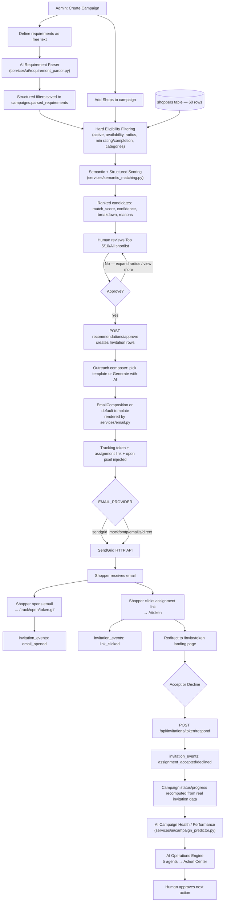
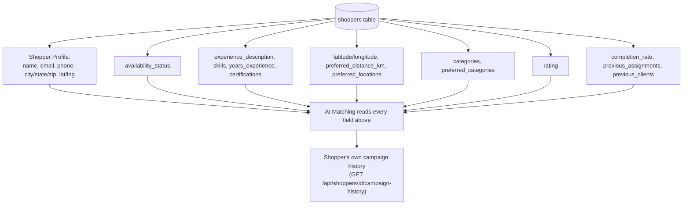
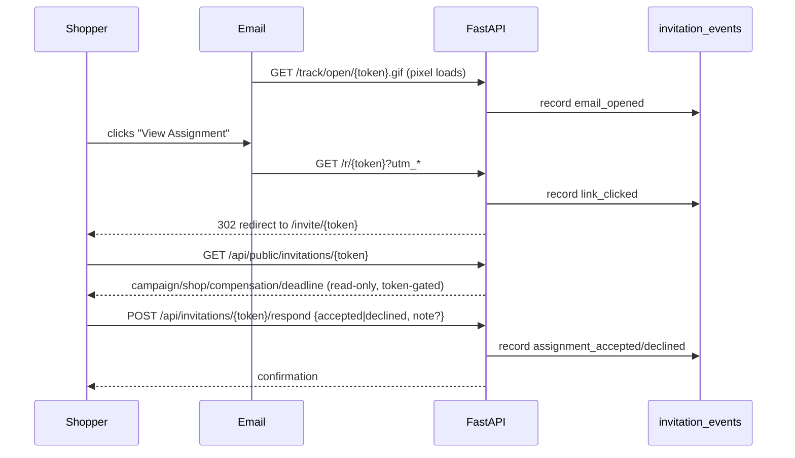
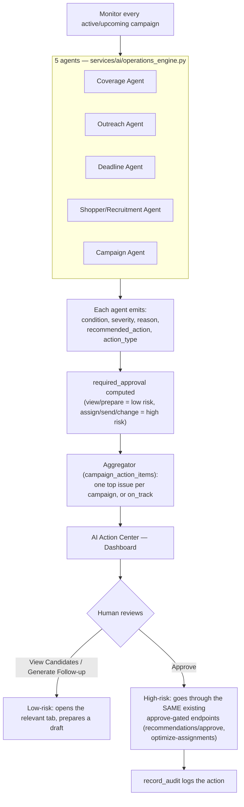

# SHOPPERMATCH.AI — Workflows

All workflows below trace to the actual endpoints/functions listed in `SHOPPERMATCH_AI_ARCHITECTURE.md`. No step is aspirational unless explicitly marked **(proposed)**.

---

## 1. Complete End-to-End Workflow



---

## 2. Campaign Workflow by Bucket

Buckets are computed by `routers/campaigns.py::status_bucket()` from `campaign.status`, not a separate field.

### Active campaign
```
Campaign (status=active)
  → Shops (with required_shoppers, coordinates, category)
  → AI Recommendations (run per shop, on demand)
  → Candidate shortlist → human approval → Invitation rows created
  → Outreach (template or AI-personalized) → SendGrid/mock
  → Tracking (open/click/response events)
  → Progress (completed_shops / total_shops, shown on Overview + Dashboard)
  → AI Campaign Health (readiness %, shop coverage, eligible shoppers, candidate quality, expected completion, risks)
```
UI: `CampaignDetail.tsx` — Overview, Shops, Shoppers, AI Recommendations, Outreach, Tracking, Insights, Audit Logs tabs. Backend: `routers/campaigns.py` + `routers/ai.py`. DB: `campaigns`, `shops`, `invitations`, `invitation_events`.

### Upcoming campaign
```
Campaign (status=upcoming, deadline in the future)
  → AI Campaign Readiness (same campaign_health() function as Active — one function, this presentation)
  → Eligible shopper coverage vs. required count
  → Risks surfaced (e.g. "Pune currently has insufficient eligible shoppers for N shop(s)")
  → Recruitment/outreach preparation via the same Recommendations/Outreach tabs
```
Same backend function (`campaign_predictor.campaign_health`) as Active — the "readiness" framing is just how the UI presents the identical computation for a not-yet-started campaign. No separate readiness-only code path exists.

### Completed campaign
```
Campaign (status=completed)
  → AI Performance Summary (services/ai/campaign_predictor.py::performance_summary)
  → Completion rate, response rate, accepted/declined counts
  → Per-city acceptance rate comparison
  → Templated (not model-generated) summary sentence, e.g.
    "Acceptance was strongest in Mumbai (78%) and lower in Pune (52%)."
```
UI: `AiPerformanceCard` in the Insights tab, shown only when `bucket === "completed"`.

---

## 3. Shopper Management Workflow



Every one of these fields feeds directly into `score_shopper()`'s seven weighted factors (semantic similarity, distance, category experience, availability, completion history, rating, client experience) — see Architecture doc §1. Fields the product brief mentions but the schema doesn't actually have (e.g. a separate "response_rate" column) are **never fabricated**: `score_shopper` only reads columns that exist, and the acceptance predictor computes response/acceptance rate live from `invitations` rather than storing a stale duplicate.

---

## 4. Outreach Architecture (detailed)

```mermaid
flowchart TD
    SEL1[Select Campaign] --> SEL2[Select Shop]
    SEL2 --> SEL3[Select Shopper]
    SEL3 --> SEL4{Template or AI?}
    SEL4 -->|Template| TPL["Load EmailTemplate row\n(GET /api/email-templates)"]
    SEL4 -->|"✨ Generate with AI"| AI["POST /api/ai/personalize-email\n(services/ai/email_personalizer.py)"]
    TPL --> CTX["services/email.py::build_variable_context()"]
    AI --> CTX2[AI-composed subject/body — still passes through the same renderer]
    CTX --> RENDER["render_variables() / render_composed_email()"]
    CTX2 --> RENDER
    RENDER --> PREVIEW[Preview in composer — user can edit]
    PREVIEW --> GEN["POST /api/invitations\n→ creates Invitation row + tracking_token"]
    GEN --> LINK["build_click_url() → /r/token?utm_*"]
    GEN --> PIXEL["pixel_url() → /track/open/token.gif"]
    LINK --> HTML[Final HTML assembled]
    PIXEL --> HTML
    HTML --> SEND["POST /{id}/send → services/outbox.py queues EmailJob"]
    SEND --> PROVIDER[send_email() dispatches to configured EMAIL_PROVIDER]
    PROVIDER --> EVENTS[invitation_events: email_sent/delivered/opened/clicked]
    EVENTS --> RESPONSE[Shopper accept/decline]
    RESPONSE --> AUDIT["record_audit() — every send/generate action logged"]
```

**Retry/failure:** `services/outbox.py` retries a queued `EmailJob` up to `EMAIL_MAX_ATTEMPTS` (default 3) with `next_attempt_at` backoff; failures are recorded on the job row (`last_error`) and as an `invitation_events` entry, never silently dropped.

**Never duplicated:** both the manual Template flow and the AI-generated flow converge on the exact same `services/email.py` rendering functions before a message is ever queued — there is one rendering code path, not two.

---

## 5. Tracking / Response Workflow



Privacy/security notes: the tracking token is a random UUID, never a raw database ID; there is no PII in the URL besides the token itself; the public endpoints only ever return the specific invitation matching that exact token (no enumeration).

---

## 6. AI Operations Engine Flow (Phase 23/24)



This is deliberately **not** an autonomous agent loop — every "Execute" step in the diagram is a human clicking an existing button; the Operations Engine only ever *proposes*.

---

## 7. Demo Scenario Script (Section 28)

A recommended order for a live client walkthrough, matching what's actually built:

1. **Login** (`/login`, demo credentials shown on screen).
2. **Dashboard** — point out the funnel KPIs, the AI Action Center (real severity-ranked issues), and ask the Operations Assistant a question live (e.g. "Which campaign needs attention?").
3. **Open an Active Campaign** → **AI Recommendations tab**.
4. **Run AI Matching** for a shop — show the requirement summary sentence, the eligible/excluded breakdown, and the Top 5/10/All shortlist toggle.
5. **View Match Breakdown** on a candidate — show the weighted score table, confidence label, and the AI Acceptance Probability panel (point out it says "Insufficient historical data" when honest, not a fake number).
6. **View Profile** on a candidate — opens the `ShopperDrawer` with real rating/completion/campaign history.
7. **Approve** a shortlist selection — show the resulting invitation reference IDs.
8. **AI Outreach Prioritization card** — explain HIGH/MEDIUM/LOW.
9. Go to **Outreach** — select the same campaign/shop/shopper, click **"✨ Generate with AI"** — show the personalized draft populate live, then explain the user must still review/edit before sending.
10. **Send** (or **Send Test** to a real inbox) — show the tracking token/link get generated.
11. Open the received email (if using Send Test) → click the assignment link → land on the shopper page → **Accept**.
12. Return to **Tracking** — show the event moved from clicked → accepted in real time.
13. Open **Insights** — show the Data Quality and Anomaly cards, and ask the AI a natural-language question.
14. Return to **Dashboard Action Center** — show the campaign's status changed now that a real assignment exists.

---

## 8. Testing Strategy (verified vs. proposed)

**Verified:** `backend/tests/test_acceptance.py` exists (pytest + pytest-asyncio + httpx are in `requirements.txt`), exercising the accept/decline endpoint. No other test files exist in the repository.

**Proposed E2E test** (not currently implemented — this is the target scenario a future test suite should cover):

```
1. Seed/verify 60 shoppers exist
2. Create a campaign + shop via API
3. Call GET /shops/{id}/recommendations — assert ranked results, all shopper_ids trace to real rows
4. Call POST recommendations/approve — assert Invitation rows created
5. Call POST /api/ai/personalize-email — assert subject/body reference only real fields
6. Call POST /api/invitations/{id}/send — assert EmailJob queued
7. Simulate open/click via the tracking endpoints
8. Call POST /respond — assert invitation_events + campaign progress update
9. Call GET /api/ai/campaigns/{id}/performance — assert numbers match the invitations created above
```

🔴 **Status: this end-to-end test does not exist yet** — flagged here as a Phase 4 backlog item, not claimed as implemented.
